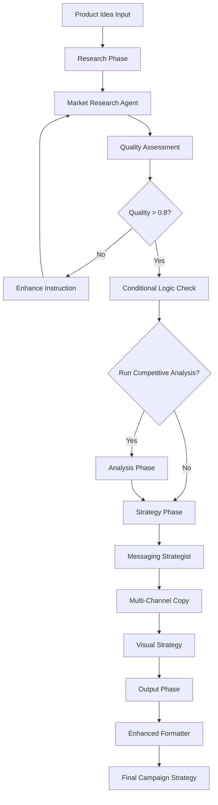
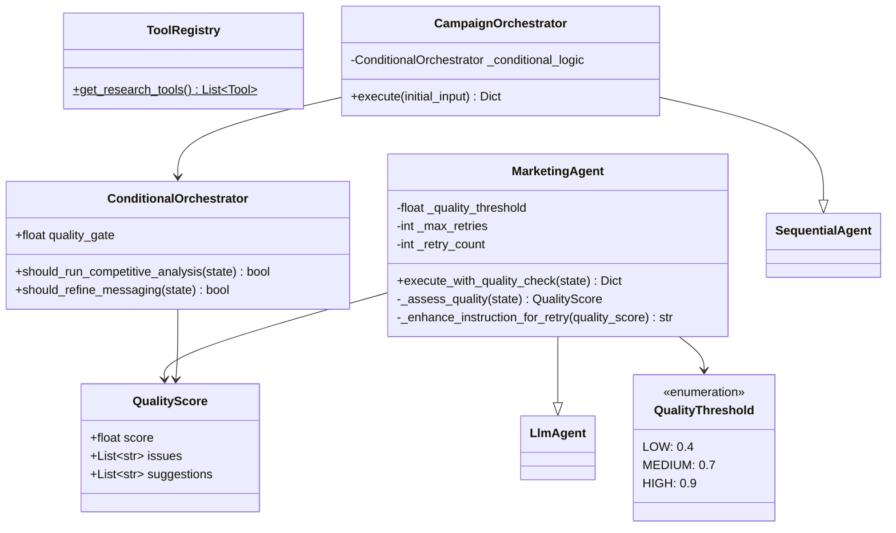
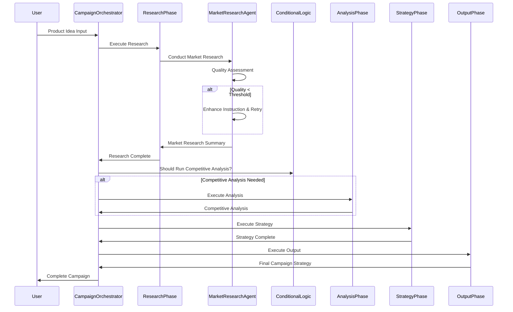

# Marketing Agent System Documentation

## Executive Summary

The Marketing Agent System is an AI-powered marketing campaign generation platform that automates the entire campaign development process from initial market research to final campaign brief delivery. By leveraging Google's Generative AI capabilities and a multi-agent architecture, the system delivers professional-quality marketing campaigns in minutes rather than days.

The platform employs specialized AI agents working in sequence: Market Research, Competitive Intelligence, Messaging Strategy, Multi-Channel Copy Writing, Visual Strategy, and Campaign Brief Formatting. Each agent is optimized for its specific domain expertise, ensuring high-quality outputs at every stage of the campaign development process.

## Key Value Propositions

###  **Accelerated Campaign Development**
- **Speed Improvement**: Complete campaign development in minutes vs. traditional weeks
- **Automated Workflow**: Eliminates manual handoffs between marketing disciplines
- **Consistent Quality**: Maintains professional standards across all campaign elements

###  **Specialized Expertise**
- **Domain-Specific Agents**: Each agent optimized for specific marketing functions
- **Research-Driven Approach**: Market research agent provides data-backed insights
- **Creative Diversity**: Multiple ad copy variations and visual concepts generated

###  **Data-Driven Intelligence**
- **Real-Time Market Data**: Google Search integration for current market insights
- **Competitive Analysis**: Automated competitor research and positioning
- **Quantified Insights**: Statistical validation with source attribution

###  **Enterprise-Ready Architecture**
- **Quality Assurance**: Built-in quality assessment and iterative refinement
- **Scalable Design**: Modular architecture supporting easy expansion
- **Conditional Logic**: Smart workflow optimization based on context

## Overview

The Marketing Agent System is a sophisticated multi-agent framework built on Google's ADK (Agent Development Kit) that orchestrates campaign development through specialized AI agents. The system employs conditional orchestration, quality assessment, and iterative refinement to create comprehensive marketing campaigns.

## System Architecture

### Core Components

#### 1. Base Agent Framework 
- **MarketingAgent**: Enhanced LlmAgent with built-in quality assessment
- **Quality Assessment**: Automatic output evaluation with retry logic
- **Tool Integration**: Extensible tool registry for research capabilities

#### 2. Agent Hierarchy
- **Specialist Agents**: Domain-specific agents for different marketing functions
- **Phase Agents**: Sequential orchestration of related activities
- **Root Orchestrator**: Conditional workflow management

#### 3. Quality Control System
- **QualityThreshold Enum**: Standardized quality levels (LOW, MEDIUM, HIGH)
- **QualityScore**: Structured quality assessment with issues and suggestions
- **Iterative Refinement**: Automatic retry with enhanced prompts

## Agent Specifications

### Research Phase
- **Market Research Agent**: Conducts comprehensive market analysis using Google Search
- **Quality Threshold**: 0.8 (HIGH)
- **Tools**: Google Search API
- **Key Features**: 5-7 research dimensions, quantified insights, source attribution

### Analysis Phase
- **Competitive Intelligence Agent**: Performs competitive landscape analysis
- **Quality Threshold**: 0.7 (MEDIUM)
- **Tools**: Google Search API
- **Key Features**: 5-8 competitor analysis, positioning maps, differentiation opportunities

### Strategy Phase
- **Messaging Strategist Agent**: Develops strategic messaging frameworks
  - **Features**: Messaging hierarchy, audience segmentation, emotional triggers
- **Multi-Channel Copy Agent**: Creates platform-specific copy variations
  - **Features**: 6+ platforms, 3 variations per platform, character optimization
- **Visual Strategy Agent**: Suggests visual design strategies
  - **Features**: Platform-specific concepts, A/B testing opportunities

### Output Phase
- **Enhanced Formatter Agent**: Consolidates all outputs into final strategy document
- **Features**: Executive-ready format, success metrics, implementation timelines

## Agent Instruction Architecture

### Instruction Design Philosophy
The system employs highly specialized, detailed instructions for each agent to ensure consistent, professional output. Each instruction follows a structured format:

1. **Role Definition**: Clear agent identity and responsibilities
2. **Process Steps**: Detailed workflow breakdown
3. **Input Requirements**: Specific data dependencies
4. **Output Format**: Standardized response structure
5. **Quality Standards**: Performance criteria and validation rules

### Agent Instructions Overview

#### Quality Assessor Agent
```
Role: Quality Assessment Agent
Purpose: Evaluate completeness, accuracy, and professional standards
Key Process:
- Review content across 4 dimensions
- Assign quality scores (0.0-1.0)
- Identify issues and improvement suggestions
- Determine professional standard compliance
```

#### Market Research Agent
```
Role: Senior Market Researcher Agent
Purpose: Comprehensive market analysis with competitive intelligence
Key Process:
- Analyze 5-7 research dimensions
- Cross-reference multiple authoritative sources
- Quantify insights with confidence levels
- Identify opportunities and risks
Critical Requirements:
- Source attribution for all claims
- Recent data preference (2023-2025)
- Conflict identification across sources
```

#### Competitive Intelligence Agent
```
Role: Competitive Intelligence Agent
Purpose: Competitive landscape analysis and positioning
Key Process:
- Identify 5-8 key competitors
- Research value propositions and pricing
- Create competitive positioning maps
- Identify differentiation opportunities
Requirements:
- Research-based analysis only
- Source citations for all claims
- Actionable positioning insights
```

#### Messaging Strategist Agent
```
Role: Senior Messaging Strategist Agent
Purpose: Strategic messaging architecture development
Key Process:
- Synthesize market and competitive insights
- Develop hierarchical messaging structure
- Create audience-specific messaging
- Include emotional triggers and rational benefits
Validation Requirements:
- Cross-check against competitive analysis
- Verify supportable claims
- Address customer pain points
```

#### Multi-Channel Copy Agent
```
Role: Multi-Channel Ad Copy Specialist
Purpose: Platform-optimized ad copy creation
Key Process:
- Create copy for 6+ marketing channels
- Generate 3 variations per platform
- Optimize for platform-specific behaviors
- Include character count specifications
Platforms Covered:
- Google Ads, Facebook/Meta, LinkedIn, Twitter/X
- Instagram, Email, YouTube
```

#### Visual Strategy Agent
```
Role: Visual Strategy Agent
Purpose: Comprehensive visual concept development
Key Process:
- Platform-specific visual concepts
- Detailed creative briefs
- Color psychology and composition
- A/B testing opportunities
Requirements:
- Platform aspect ratio considerations
- Text overlay limitations
- Video concepts for dynamic platforms
```

#### Enhanced Formatter Agent
```
Role: Campaign Strategy Formatter
Purpose: Executive-ready strategy document creation
Key Process:
- Comprehensive document assembly
- Professional markdown formatting
- Confidence levels and attribution
- Implementation timelines
Quality Standards:
- Cross-reference all analyses
- Actionable recommendations
- Executive-level professionalism
- Clear success metrics
```



## Class Diagram



## Agent Interaction Sequence



## Configuration and Setup

### Environment Variables
```bash
GOOGLE_GENAI_MODEL=gemini-2.0-flash
```

### Dependencies
- `google.adk.agents`: Core agent framework
- `google.adk.tools`: Tool integrations
- `pydantic`: Data validation
- `python-dotenv`: Environment management

### Model Configuration
- **Default Model**: `gemini-2.0-flash`
- **Fallback**: Environment variable override support

## Quality Control System

### Quality Assessment Process
1. **Automatic Evaluation**: Each agent output is automatically assessed
2. **Threshold Checking**: Results compared against agent-specific thresholds
3. **Retry Logic**: Failed outputs trigger instruction enhancement and retry
4. **Metadata Addition**: Quality scores attached to state for downstream use

### Quality Metrics
- **Length-based Scoring**: Initial implementation uses output length as quality proxy
- **Issue Detection**: Identifies common problems (e.g., insufficient detail)
- **Improvement Suggestions**: Provides specific enhancement recommendations

## Conditional Orchestration

### Decision Points
1. **Competitive Analysis**: Triggered by competitor mentions in market research
2. **Messaging Refinement**: Based on quality score thresholds
3. **Phase Skipping**: Allows workflow optimization based on context

### Orchestration Logic
- **Keyword Detection**: Simple heuristics for competitive analysis trigger
- **Quality Gates**: Threshold-based decision making
- **State Evaluation**: Context-aware workflow adaptation

## Usage Examples

### Basic Usage
```python
# Initialize the system
root_agent = CampaignOrchestrator()

# Execute campaign development
result = await root_agent.execute("AI-powered fitness tracker")

# Access results
final_strategy = result['final_campaign_strategy']
market_research = result['market_research_summary']
```

### Quality Monitoring
```python
# Check quality scores
quality_score = result.get('market_research_summary_quality')
if quality_score.score < 0.7:
    print(f"Quality issues: {quality_score.issues}")
    print(f"Suggestions: {quality_score.suggestions}")
```

## Extension Points

### Adding New Agents
1. Create new MarketingAgent instance
2. Define instruction and output key
3. Set appropriate quality threshold
4. Integrate into phase structure

### Custom Tools
1. Implement tool interface
2. Add to ToolRegistry
3. Assign to relevant agents

### Quality Metrics
1. Override `_assess_quality` method
2. Implement domain-specific scoring
3. Define custom thresholds

## Performance Considerations

### Retry Strategy
- **Maximum Retries**: 2 attempts per agent
- **Quality-Based Triggering**: Retries only when quality threshold not met
- **Instruction Enhancement**: Dynamic prompt improvement based on quality issues
- **Exponential Backoff**: Not implemented (future enhancement)

### Tool Usage Optimization
- **Research Tools**: Strategic use limited to research and competitive analysis phases
- **Rate Limiting**: Handled by underlying ADK framework
- **Caching**: Not implemented (future enhancement opportunity)
- **API Efficiency**: Conditional tool usage based on workflow needs

### Temperature Control Impact
- **Consistency vs Creativity**: 0.3 temperature balances reliability with useful variation
- **Response Time**: Lower temperature generally reduces inference time
- **Token Efficiency**: More predictable output lengths reduce costs
- **Quality Predictability**: Consistent outputs enable better quality assessment

## Implementation Examples

### Basic Campaign Generation
```python
# Initialize the system
root_agent = CampaignOrchestrator()

# Execute campaign development
result = await root_agent.execute("AI-powered fitness tracker")

# Access comprehensive results
final_strategy = result['final_campaign_strategy']
market_research = result['market_research_summary']
competitive_analysis = result['competitive_analysis']
messaging = result['strategic_messaging']
copy_variations = result['multi_channel_copy']
visual_concepts = result['visual_strategy']
```

### Quality Monitoring
```python
# Check quality scores across all agents
quality_scores = {
    key: value for key, value in result.items() 
    if key.endswith('_quality')
}

# Identify quality issues
for agent, quality in quality_scores.items():
    if quality.score < 0.7:
        print(f"Quality concerns in {agent}:")
        print(f"Issues: {quality.issues}")
        print(f"Suggestions: {quality.suggestions}")
```

### Conditional Workflow Analysis
```python
# Check if competitive analysis was triggered
if 'competitive_analysis' in result:
    print("Competitive analysis was performed")
    print(f"Competitors identified: {result['competitive_analysis']}")
else:
    print("Competitive analysis was skipped")
```

## Configuration Management

### Environment Variables
```bash
# Required
GOOGLE_GENAI_MODEL=gemini-2.0-flash

# Optional (with defaults)
GOOGLE_API_KEY=your_api_key_here
```

### Agent Configuration
```python
# Custom quality thresholds
market_research_agent = MarketingAgent(
    name="CustomMarketResearcher",
    instruction=MARKET_RESEARCH_INSTRUCTION,
    output_key="market_research_summary",
    tools=ToolRegistry.get_research_tools(),
    quality_threshold=0.9  # Higher threshold for critical research
)
```

## Extension Points

### Adding New Agents
```python
# Create new specialized agent
social_media_agent = MarketingAgent(
    name="SocialMediaSpecialist",
    instruction=SOCIAL_MEDIA_INSTRUCTION,
    output_key="social_media_strategy",
    quality_threshold=0.8
)

# Integrate into workflow
strategy_phase = SequentialAgent(
    name="StrategyPhase",
    sub_agents=[
        messaging_strategist_agent,
        multi_channel_copy_agent,
        social_media_agent,  # New agent
        visual_suggester_agent
    ]
)
```

### Custom Tool Integration
```python
# Create custom tool
def custom_market_tool():
    # Implementation
    pass

# Add to registry
class ExtendedToolRegistry(ToolRegistry):
    @staticmethod
    def get_advanced_research_tools():
        return [
            google_search,
            custom_market_tool  # New tool
        ]
```

### Quality Metric Customization
```python
# Override quality assessment
class AdvancedMarketingAgent(MarketingAgent):
    async def _assess_quality(self, state: Dict[str, Any]) -> QualityScore:
        output = state.get(self.output_key, "")
        
        # Custom quality metrics
        word_count = len(output.split())
        source_count = output.count('[source:')
        
        # Weighted scoring
        score = (word_count / 500) * 0.6 + (source_count / 3) * 0.4
        
        return QualityScore(
            score=min(1.0, score),
            issues=self._identify_custom_issues(output),
            suggestions=self._generate_custom_suggestions(output)
        )
```
