# Enhanced Marketing Agents System Documentation

## Overview

This system implements an advanced multi-agent marketing campaign assistant using Google's Agent Development Kit (ADK). It orchestrates several specialized agents to create comprehensive marketing campaigns through a sequential workflow with built-in quality assessment, iterative refinement, and conditional orchestration logic.

## Executive Summary

The Enhanced Marketing Agents System is an AI-powered marketing campaign generation platform that automates the entire campaign development process from initial market research to final campaign brief delivery. By leveraging Google's Generative AI capabilities and a sophisticated multi-agent architecture, the system delivers professional-quality marketing campaigns with built-in quality assurance and adaptive workflow logic.

The platform employs six specialized AI agents working in sequence: Market Research, Competitive Intelligence, Messaging Strategy, Multi-Channel Ad Copy Writing, Visual Strategy, and Campaign Brief Formatting. Each agent is optimized for its specific domain expertise and includes quality assessment mechanisms to ensure high-quality outputs at every stage.

## Key Value Propositions

### **Accelerated Campaign Development**
- **Speed Improvement**: Complete campaign development in minutes vs. traditional weeks
- **Automated Workflow**: Eliminates manual handoffs between marketing disciplines
- **Quality Assurance**: Built-in quality assessment with automatic retry mechanisms

### **Specialized Expertise**
- **Domain-Specific Agents**: Each agent optimized for specific marketing functions
- **Research-Driven Approach**: Market research and competitive intelligence provide data-backed insights
- **Multi-Channel Creative**: Generates content optimized for different marketing channels

### **Adaptive Intelligence**
- **Conditional Logic**: Workflow adapts based on intermediate results
- **Quality Thresholds**: Configurable quality gates with automatic refinement
- **Iterative Improvement**: Agents can retry and enhance outputs based on quality feedback

## Architecture

The system follows a hierarchical agent pattern with quality assessment integration, where a root orchestrator coordinates multiple specialized sub-agents with built-in quality control and conditional workflow logic.

## Configuration

### Environment Setup

```python
# Environment variable loading with fallback mechanism
try:
    from dotenv import load_dotenv
    load_dotenv()
    MODEL_NAME = os.environ.get("GOOGLE_GENAI_MODEL", "gemini-2.0-flash")
except ImportError:
    print("Warning: python-dotenv not installed. Ensure API key is set")
    MODEL_NAME = "gemini-2.0-flash"
```

**Environment Variables:**
- `GOOGLE_GENAI_MODEL`: Specifies the Google Generative AI model (default: "gemini-2.0-flash")

## Core Components

### 1. Quality Assessment System

#### QualityThreshold Enum
```python
class QualityThreshold(Enum):
    LOW = 0.4
    MEDIUM = 0.7
    HIGH = 0.9
```

**Purpose**: Defines standardized quality thresholds for different quality levels across the system.

#### QualityScore Dataclass
```python
@dataclass
class QualityScore:
    score: float
    issues: List[str]
    suggestions: List[str]
```

**Purpose**: Structured representation of quality assessment results including quantitative score and qualitative feedback.

### 2. ToolRegistry Class

A utility class that manages tool integrations for the agents.

```python
class ToolRegistry:
    @staticmethod
    def get_research_tools():
        return [google_search]
```

**Purpose**: Centralizes tool management and makes it easy to add new tools or modify existing ones.

**Methods**:
- `get_research_tools()`: Returns a list of research-related tools (currently includes Google Search)

### 3. MarketingAgent Class

An enhanced LLM agent that extends the base `LlmAgent` class with quality assessment, retry logic, and marketing-specific configurations.

```python
class MarketingAgent(LlmAgent):
    _quality_threshold: float = PrivateAttr()
    _max_retries: int = PrivateAttr(default=2)
    _retry_count: int = PrivateAttr(default=0)
```

**Key Features**:
- **Quality Assessment**: Built-in quality scoring mechanism
- **Retry Logic**: Automatic retry with enhanced instructions
- **Private Attributes**: Uses Pydantic private attributes for internal state management

**Parameters**:
- `name`: Unique identifier for the agent
- `instruction`: System prompt/instruction for the agent's behavior
- `output_key`: Key used to store the agent's output in the workflow
- `tools`: Optional list of tools the agent can use
- `quality_threshold`: Minimum quality score required (default: 0.7)

**Key Methods**:

#### execute_with_quality_check()
```python
async def execute_with_quality_check(self, state: Dict[str, Any]) -> Dict[str, Any]:
    """Execute with built-in quality assessment and retry logic"""
    for attempt in range(self._max_retries + 1):
        result_state = await self.execute(state)
        quality_score = await self._assess_quality(result_state)
        
        if quality_score.score >= self._quality_threshold or attempt == self._max_retries:
            result_state[f"{self.output_key}_quality"] = quality_score
            return result_state
        
        self.instruction = self._enhance_instruction_for_retry(quality_score)
    
    return result_state
```

**Purpose**: Executes the agent with automatic quality assessment and retry logic.

#### _assess_quality()
```python
async def _assess_quality(self, state: Dict[str, Any]) -> QualityScore:
    """Simple quality assessment based on output length and content"""
    output = state.get(self.output_key, "")
    score = min(1.0, len(output) / 500)  # Basic length-based scoring
    issues = []
    suggestions = []
    
    if len(output) < 100:
        issues.append("Output too short")
        suggestions.append("Provide more detailed analysis")
    
    return QualityScore(score=score, issues=issues, suggestions=suggestions)
```

**Purpose**: Provides basic quality assessment with extensible framework for more sophisticated evaluation.

#### _enhance_instruction_for_retry()
```python
def _enhance_instruction_for_retry(self, quality_score: QualityScore) -> str:
    """Dynamic prompt enhancement based on quality issues"""
    enhancement = f"\n\nPREVIOUS ATTEMPT HAD ISSUES: {', '.join(quality_score.issues)}"
    enhancement += f"\nIMPROVEMENT SUGGESTIONS: {', '.join(quality_score.suggestions)}"
    enhancement += "\nPlease address these issues in your response."
    return self.instruction + enhancement
```

**Purpose**: Dynamically enhances agent instructions based on quality assessment feedback.

### 4. ConditionalOrchestrator Class

```python
class ConditionalOrchestrator:
    def __init__(self):
        self.quality_gate = QualityThreshold.MEDIUM.value
        
    async def should_run_competitive_analysis(self, state: Dict[str, Any]) -> bool:
        """Decide if competitive analysis is needed based on market research"""
        market_research = state.get('market_research_summary', '')
        return any(word in market_research.lower() for word in ['competitor', 'competition', 'rival', 'market leader'])
    
    async def should_refine_messaging(self, state: Dict[str, Any]) -> bool:
        """Check if messaging needs refinement based on quality scores"""
        quality_score = state.get('strategic_messaging_quality', QualityScore(0.5, [], []))
        return quality_score.score < self.quality_gate
```

**Purpose**: Implements conditional logic for adaptive workflow orchestration based on intermediate results and quality assessments.

## Agent Instances

### 1. Quality Assessor Agent
- **Name**: QualityAssessor
- **Purpose**: Provides quality assessment capabilities across the system
- **Tools**: None
- **Output Key**: quality_assessment

### 2. Market Research Agent
- **Name**: SeniorMarketResearcher
- **Purpose**: Conducts comprehensive market research using available tools
- **Tools**: Google Search
- **Output Key**: market_research_summary
- **Quality Threshold**: 0.8 (HIGH)

### 3. Competitive Intelligence Agent
- **Name**: CompetitiveIntelligence
- **Purpose**: Analyzes competitive landscape and market positioning
- **Tools**: Google Search
- **Output Key**: competitive_analysis
- **Quality Threshold**: 0.7 (MEDIUM)

### 4. Messaging Strategist Agent
- **Name**: SeniorMessagingStrategist
- **Purpose**: Develops strategic messaging framework based on research
- **Tools**: None
- **Output Key**: strategic_messaging
- **Quality Threshold**: 0.8 (HIGH)

### 5. Multi-Channel Copy Writer Agent
- **Name**: MultiChannelCopywriter
- **Purpose**: Creates advertising copy optimized for multiple channels
- **Tools**: None
- **Output Key**: multi_channel_copy
- **Quality Threshold**: 0.7 (MEDIUM)

### 6. Visual Strategy Agent
- **Name**: VisualStrategist
- **Purpose**: Develops visual concepts and creative direction
- **Tools**: None
- **Output Key**: visual_strategy
- **Quality Threshold**: 0.7 (MEDIUM)

### 7. Enhanced Formatter Agent
- **Name**: CampaignStrategyFormatter
- **Purpose**: Formats comprehensive final campaign strategy document
- **Tools**: None
- **Output Key**: final_campaign_strategy

## Workflow Orchestration

### Phase Agents

The system is organized into distinct phases for better modularity and control:

#### Research Phase
```python
research_phase = SequentialAgent(
    name="ResearchPhase",
    sub_agents=[market_research_agent],
    description="Initial market research phase"
)
```

#### Analysis Phase
```python
analysis_phase = SequentialAgent(
    name="AnalysisPhase",
    sub_agents=[competitive_intel_agent],
    description="Competitive analysis and deeper insights"
)
```

#### Strategy Phase
```python
strategy_phase = SequentialAgent(
    name="StrategyPhase",
    sub_agents=[
        messaging_strategist_agent,
        multi_channel_copy_agent,
        visual_suggester_agent
    ],
    description="Strategic messaging and creative development"
)
```

#### Output Phase
```python
output_phase = SequentialAgent(
    name="OutputPhase",
    sub_agents=[enhanced_formatter_agent],
    description="Final strategy document creation"
)
```

### CampaignOrchestrator Class

```python
class CampaignOrchestrator(SequentialAgent):
    _conditional_logic: ConditionalOrchestrator = PrivateAttr()

    def __init__(self):
        super().__init__(
            name="CampaignOrchestrator",
            description="Full campaign development workflow with conditional logic",
            sub_agents=[
                research_phase,
                analysis_phase,
                strategy_phase,
                output_phase,
            ]
        )
        self._conditional_logic = ConditionalOrchestrator()

    async def execute(self, initial_input: str) -> Dict[str, Any]:
        state = {"product_idea": initial_input}
        
        # Research phase
        state = await research_phase.execute(state)
        
        # Conditional analysis phase
        if await self._conditional_logic.should_run_competitive_analysis(state):
            state = await analysis_phase.execute(state)
        
        # Strategy and output phases
        state = await strategy_phase.execute(state)
        state = await output_phase.execute(state)
        
        return state
```

**Key Features**:
- **Conditional Execution**: Analysis phase only runs if competitive analysis is needed
- **State Management**: Maintains state across all phases
- **Modular Design**: Each phase can be modified independently

## System Flow Diagram


## Detailed System Flow

### Phase 1: Initialization
1. **User Input** → System receives campaign requirements
2. **Campaign Orchestrator** → Begins sequential workflow with conditional logic

### Phase 2: Research Phase
3. **Market Research Agent** → Conducts comprehensive market analysis
4. **Quality Assessment** → Evaluates output quality and triggers retry if needed
5. **Research Summary** → Consolidates findings into structured output

### Phase 3: Conditional Analysis Phase
6. **Conditional Logic** → Determines if competitive analysis is needed
7. **Competitive Intelligence Agent** → Analyzes competitive landscape (if triggered)
8. **Quality Assessment** → Ensures competitive analysis meets standards

### Phase 4: Strategy Phase
9. **Messaging Strategist** → Develops strategic messaging framework
10. **Multi-Channel Copy Writer** → Creates channel-specific advertising copy
11. **Visual Strategy Agent** → Develops visual concepts and creative direction
12. **Quality Checks** → Each agent includes quality assessment and retry logic

### Phase 5: Output Phase
13. **Enhanced Formatter** → Assembles comprehensive final campaign strategy
14. **Final Campaign Strategy** → Delivers complete campaign package

## UML Class Diagram

```mermaid
classDiagram
    class LlmAgent {
        <<external>>
        +name: str
        +model: str
        +instruction: str
        +output_key: str
        +tools: list
        +execute(state)
    }
    
    class SequentialAgent {
        <<external>>
        +name: str
        +description: str
        +sub_agents: list
        +execute(state)
    }
    
    class QualityThreshold {
        <<enumeration>>
        LOW = 0.4
        MEDIUM = 0.7
        HIGH = 0.9
    }
    
    class QualityScore {
        <<dataclass>>
        +score: float
        +issues: List[str]
        +suggestions: List[str]
    }
    
    class ToolRegistry {
        <<utility>>
        +get_research_tools()$ list
    }
    
    class MarketingAgent {
        -_quality_threshold: float
        -_max_retries: int
        -_retry_count: int
        +__init__(name, instruction, output_key, tools, quality_threshold)
        +execute_with_quality_check(state)
        -_assess_quality(state)
        -_enhance_instruction_for_retry(quality_score)
    }
    
    class ConditionalOrchestrator {
        +quality_gate: float
        +should_run_competitive_analysis(state)
        +should_refine_messaging(state)
    }
    
    class CampaignOrchestrator {
        -_conditional_logic: ConditionalOrchestrator
        +execute(initial_input)
    }
    
    class ResearchPhase {
        +name: "ResearchPhase"
        +sub_agents: [market_research_agent]
    }
    
    class AnalysisPhase {
        +name: "AnalysisPhase"
        +sub_agents: [competitive_intel_agent]
    }
    
    class StrategyPhase {
        +name: "StrategyPhase"
        +sub_agents: [messaging_strategist_agent, multi_channel_copy_agent, visual_suggester_agent]
    }
    
    class OutputPhase {
        +name: "OutputPhase"
        +sub_agents: [enhanced_formatter_agent]
    }
    
    %% Inheritance relationships
    MarketingAgent --|> LlmAgent
    CampaignOrchestrator --|> SequentialAgent
    ResearchPhase --|> SequentialAgent
    AnalysisPhase --|> SequentialAgent
    StrategyPhase --|> SequentialAgent
    OutputPhase --|> SequentialAgent
    
    %% Composition relationships
    CampaignOrchestrator *-- ConditionalOrchestrator
    CampaignOrchestrator *-- ResearchPhase
    CampaignOrchestrator *-- AnalysisPhase
    CampaignOrchestrator *-- StrategyPhase
    CampaignOrchestrator *-- OutputPhase
    
    %% Dependency relationships
    MarketingAgent ..> QualityScore : creates
    MarketingAgent ..> QualityThreshold : uses
    ConditionalOrchestrator ..> QualityThreshold : uses
    MarketingAgent ..> ToolRegistry : uses
```



## Quality Assurance Framework

### Quality Assessment Mechanism

The system implements a comprehensive quality assurance framework:

1. **Threshold-Based Evaluation**: Each agent has configurable quality thresholds
2. **Automatic Retry Logic**: Failed quality checks trigger automatic retries
3. **Dynamic Instruction Enhancement**: Retry attempts include enhanced instructions based on quality feedback
4. **Quality Metadata**: Quality scores and feedback are preserved in the workflow state

### Quality Scoring Algorithm

Current implementation uses length-based scoring with extensible framework:

```python
score = min(1.0, len(output) / 500)  # Basic length-based scoring
```

**Extension Points**:
- Content relevance scoring
- Factual accuracy verification
- Brand consistency checks
- Channel optimization validation

### Retry Strategy

- **Maximum Retries**: 2 attempts per agent (configurable)
- **Progressive Enhancement**: Each retry includes specific feedback from quality assessment
- **Graceful Degradation**: System continues even if quality thresholds aren't met after max retries

## Conditional Logic Framework

### Adaptive Workflow Execution

The system includes sophisticated conditional logic to adapt workflow based on intermediate results:

#### Competitive Analysis Trigger
```python
async def should_run_competitive_analysis(self, state: Dict[str, Any]) -> bool:
    market_research = state.get('market_research_summary', '')
    return any(word in market_research.lower() for word in ['competitor', 'competition', 'rival', 'market leader'])
```

**Logic**: Competitive analysis phase only executes if market research identifies competitive elements.

#### Messaging Refinement Trigger
```python
async def should_refine_messaging(self, state: Dict[str, Any]) -> bool:
    quality_score = state.get('strategic_messaging_quality', QualityScore(0.5, [], []))
    return quality_score.score < self.quality_gate
```

**Logic**: Additional messaging refinement based on quality assessment results.

## Dependencies

### External Libraries
- `google.adk.agents`: Provides `LlmAgent` and `SequentialAgent` classes
- `google.adk.tools`: Provides `google_search` tool
- `dotenv`: For environment variable loading (optional)
- `os`: For environment variable access
- `asyncio`: For asynchronous execution
- `typing`: For type hints and annotations
- `dataclasses`: For structured data classes
- `enum`: For enumeration types
- `pydantic`: For private attributes and data validation

### Internal Dependencies
- `market_agents.instructions`: Contains all agent instruction constants for:
  - `QUALITY_ASSESSOR_INSTRUCTION`
  - `MARKET_RESEARCH_INSTRUCTION`
  - `COMPETITIVE_INTELLIGENCE_INSTRUCTION`
  - `MESSAGING_INSTRUCTION`
  - `MULTI_CHANNEL_COPY_INSTRUCTION`
  - `VISUAL_STRATEGY_INSTRUCTION`
  - `FORMATTER_INSTRUCTION`

## Usage

The system is designed to be used by instantiating the `root_agent`:

```python
# The root agent is ready to use
result = await root_agent.execute(user_input)
```

Or via command line interface:
```bash
# Command to run the web-based Dev UI
adk web
```

## Advanced Features

### 1. Asynchronous Execution
- All agent operations are asynchronous for better performance
- Concurrent execution where possible within sequential constraints

### 2. State Management
- Comprehensive state tracking across all workflow phases
- Quality metadata preservation for analysis and debugging

### 3. Extensible Architecture
- Plugin-based tool system via `ToolRegistry`
- Configurable quality thresholds per agent
- Modular phase system for workflow customization

### 4. Error Handling
- Graceful degradation on quality failures
- Fallback mechanisms for missing dependencies
- Comprehensive logging and debugging support

## Design Patterns

1. **Factory Pattern**: `ToolRegistry` acts as a factory for tool collections
2. **Template Method**: `MarketingAgent` provides a template for creating specialized agents
3. **Composite Pattern**: `SequentialAgent` and phase agents compose multiple sub-agents
4. **Strategy Pattern**: Each agent implements a specific strategy for its domain
5. **State Pattern**: Conditional orchestrator adapts behavior based on workflow state
6. **Observer Pattern**: Quality assessment system observes agent outputs
7. **Retry Pattern**: Built-in retry logic with exponential backoff concepts

## Performance Considerations

### Optimization Features
- **Conditional Execution**: Skips unnecessary phases based on content analysis
- **Quality Gates**: Prevents poor-quality outputs from propagating
- **Configurable Thresholds**: Allows tuning of quality vs. speed trade-offs

### Scalability Features
- **Modular Architecture**: Individual agents can be scaled independently
- **Asynchronous Operations**: Non-blocking execution for better resource utilization
- **State-Based Workflow**: Enables checkpoint and resume capabilities

## Security Considerations

### Input Validation
- State validation between agent transitions
- Quality score validation to prevent malicious scoring

### Data Privacy
- No persistent storage of sensitive campaign data
- Transient state management for privacy compliance

## Future Enhancements

### Planned Features
1. **Advanced Quality Metrics**: Content relevance, factual accuracy, brand consistency
2. **Machine Learning Integration**: Predictive quality scoring based on historical data
3. **A/B Testing Framework**: Compare different agent configurations
4. **Real-time Analytics**: Dashboard for workflow performance monitoring
5. **External API Integration**: CRM, analytics, and marketing platform connections

### Extension Points
- Custom quality assessors for domain-specific requirements
- Additional conditional logic for complex workflow scenarios
- Integration with external validation services
- Custom tool implementations for specialized research needs

This enhanced system provides a robust, scalable, and intelligent framework for automated marketing campaign development with built-in quality assurance and adaptive workflow capabilities.
